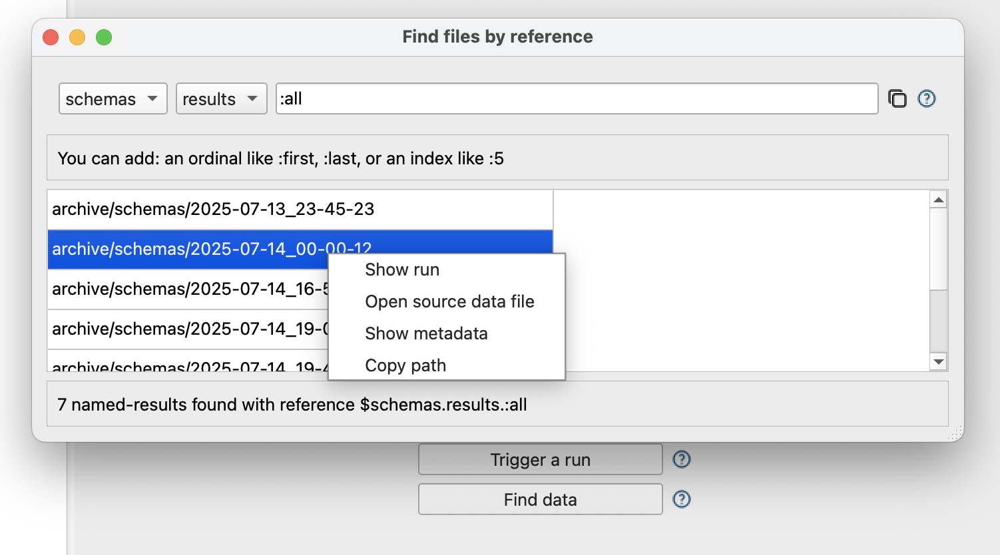
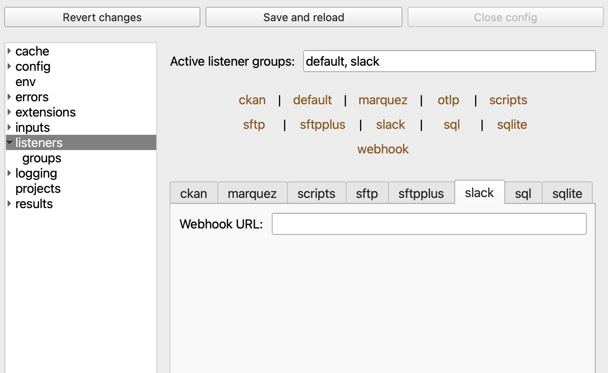

# FlightPath Data

<figure><figcaption></figcaption></figure>

## FlightPath is the power frontend to the CsvPath Framework

Preboarding your tabular data before it lands in your data lake, applications, or analytics lowers risk and reduces frustration and costs. [CsvPath Framework](https://www.csvpath.org/) is the leading data preboarding infrastructure and FlightPath is the way to turbo charge it. FlightPath is open, free, and cross-platform. Find it on [the Apple MacOS Store](https://apps.apple.com/us/app/flightpath-data/id6745823097?mt=12) or on [GitHub](https://github.com/dk107dk/flightpath/tree/main).

<figure><figcaption></figcaption></figure>

### Development and Operations

FlightPath is both a development and an operations tool. It makes development more agile by:&#x20;

* Helping you spin up preboarding projects quickly
* Providing examples and guardrails
* Minimizing configuration tasks, and&#x20;
* Providing in-context help.&#x20;

On the DataOps operations side, FlightPath:&#x20;

* Helps you find data
* Trace how data changes version-to-version and run-to-run
* Quickly stage files and load named-paths groups, and&#x20;
* Assists you in creating references and templates to match your operating requirements&#x20;

<figure><figcaption></figcaption></figure>

### Infrastructure and Integrations

FlightPath runs on MacOS and Windows 11. It supports all the same infrastructure backends that CsvPath Framework does. The storage backends are:&#x20;

* AWS S3
* Azure Blob Storage
* Google Cloud Storage
* SFTP
* Locally mounted file systems

FlightPath makes it easy to configure CsvPath Framework's integrations, including Slack, OpenTelemetry, OpenLineage, webhooks, and more.

<figure><figcaption></figcaption></figure>

> FlightPath Data is available from the Apple and Microsoft stores. As part of submitting FlightPath for distribution, the application is vetted by both companies for security and installability. For greater control, you can build FlightPath yourself from the GitHub repo. Like CsvPath, it is a Python project managed using Poetry.

## Quick links


[preboarding-for-success.md](overview/preboarding-for-success.md)



[flightpath-features.md](overview/flightpath-features.md)


## Get Started

When you open a FlightPath a default project is automatically created. As in every project, FlightPath generates a set of simple examples that show you how to write CsvPath Language and deploy to the CsvPath Framework. FlightPath also has in-context help for every feature and a documentation window that helps guide your use of CsvPath Framework capabilities.


[getting-set-up](fundamentals/getting-set-up/)



[setting-permissions.md](fundamentals/getting-set-up/setting-permissions.md)



[inviting-members.md](fundamentals/getting-set-up/inviting-members.md)

