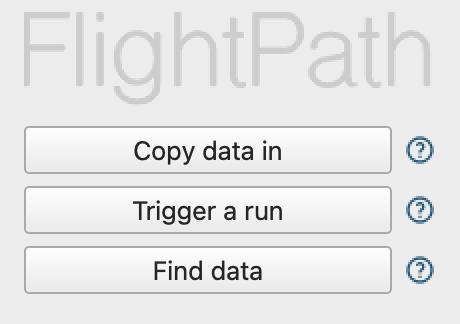

# 🛠️ Getting set up

## 1 - Install FlightPath for MacOS or Windows


{% column width="50%" %}
<figure><figcaption>
<a href="https://apps.apple.com/us/app/flightpath-data/id6745823097?mt=12">Apple Mac Store</a>
</figcaption></figure>



<figure><figcaption>
Microsoft Store
</figcaption></figure>




[GitHub is also an option](https://github.com/dk107dk/flightpath/tree/main), if you're on a different platform or have special requirements.


## 2 - Explore the built-in examples

<figure><figcaption></figcaption></figure>

## 3 - Import test data and begin preboarding

<figure><figcaption></figcaption></figure>

## 4 - Dig deeper into CsvPath Framework

There is much more you can do to automate your DataOps preboarding. Learn more at [https://www.csvpath.org](https://www.csvpath.org/).
