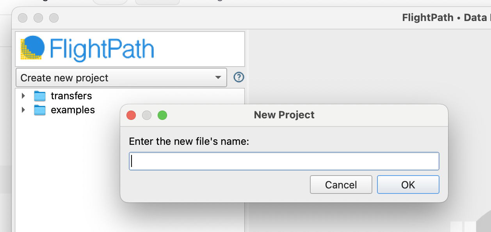
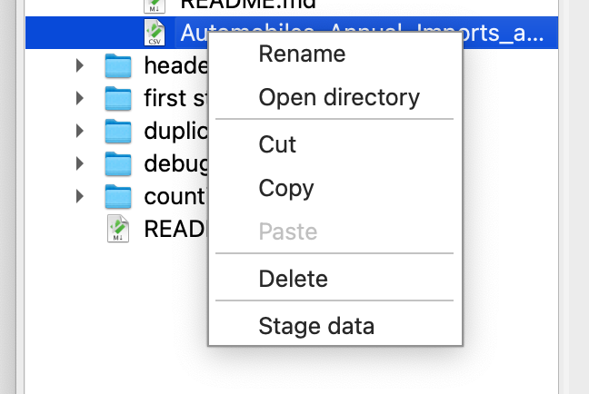
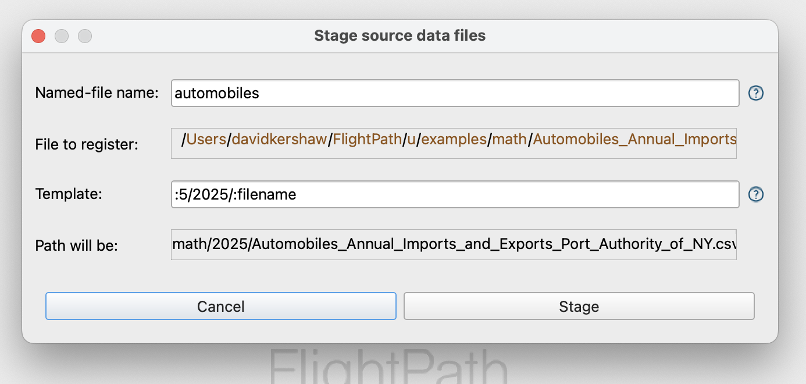
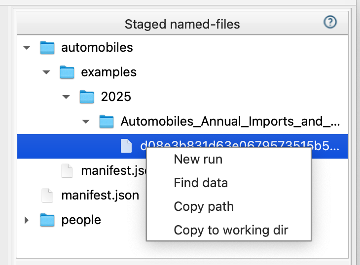
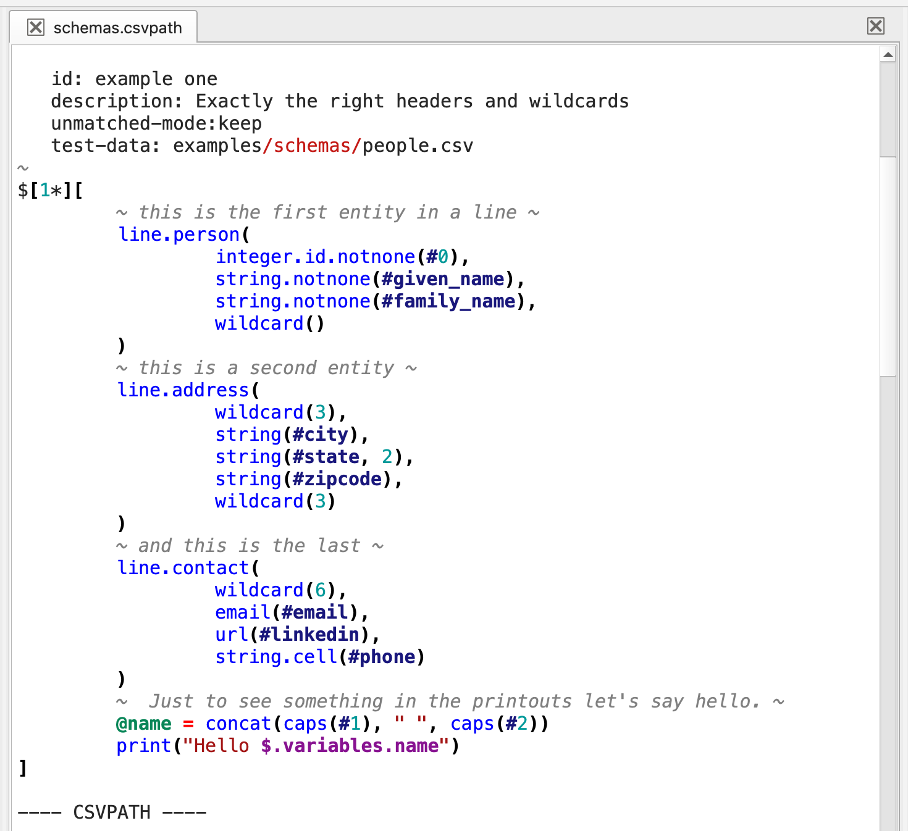
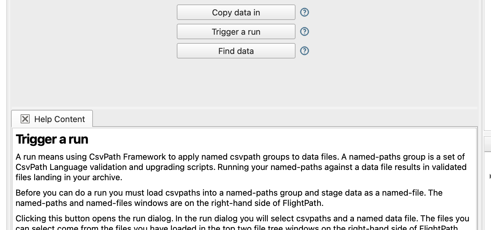
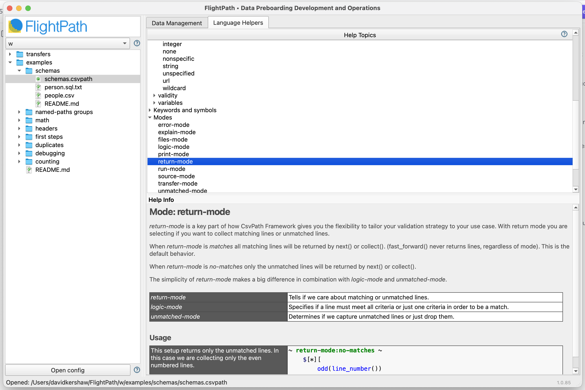
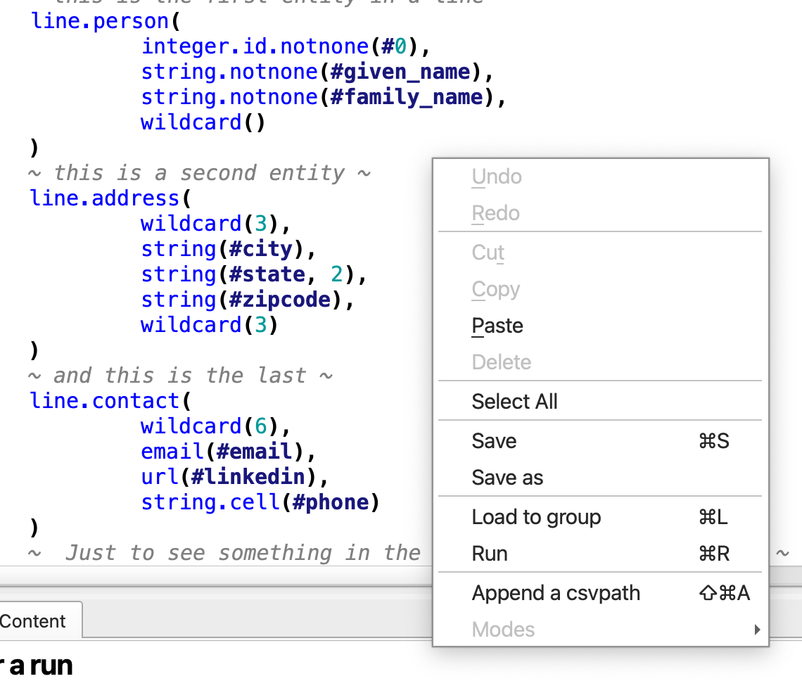

# ✨ Features

## Project Management

FlightPath helps you manage projects so you can partition data flows for easier development and management. Keeping projects focused on one or a small number of data partnerships makes development more agile and allows you to better use compute resources for higher performance and greater scalability.

When you first open FlightPath the app creates a .`flightpath` JSON configuration file in your home directory that points to your `FlightPath` projects folder. You can change the project folder's location in FlightPath's config panel. Next FlightPath creates a `Default` project. In the `Default` project, and every new project, you will see an `examples` directory. You can delete the examples if you don't need them.&#x20;

Creating a new project is as simple as selecting `Create New Project` in the drop-down at the top of the right-hand files tree. Each time you create a project in FlightPath, FlightPath creates a new CsvPath Framework project, with a new config file, archive, logs, and other assets. Every project is completely separate, with its own choice of storage backends and integrations.&#x20;

<figure><figcaption></figcaption></figure>

## Stage Data

CsvPath Framework is all about automating the process of receiving data. But during development you typically need to stage data manually. FlightPath makes it easy. Add your data files using the `Copy data in` button on center of the home screen, or open the project directory and drag your data files in. &#x20;

<figure><figcaption></figcaption></figure>

Then you can simply right-click any file to stage it in your choice of storage backend by selecting `Stage data`.

<figure><figcaption></figcaption></figure>

Give the new named-file a simple, memorable name. Optionally, add a template if you want a particular filesystem path. You can include elements of the original file path in the template.

<figure><figcaption></figcaption></figure>

Now you see your staged data in the `Staged named-files` window at the top of FlightPath's right-hand operations column.

## Write CsvPath Language Validations

Before you can load preboarding steps into CsvPath Framework you have to write them. FlightPath makes CsvPath Language more accessible by giving you a syntax highlighted editor with the ability to look up functions and features, create multi-csvpath files, and do one-off runs to iterate on your scripts.

<figure><figcaption></figcaption></figure>

### In-context Help

Every major feature in FlightPath has in-context help. Wherever you see the question mark icon you can click it to open the `Help and feedback` tray at the bottom of the app. &#x20;

<figure><figcaption></figcaption></figure>

CsvPath Language has over 150 functions to help you craft the right validation rules and data upgrading steps. And CsvPath Framework has many other features to know. FlightPath makes all this power more accessible by providing the Language Helpers tab whenever a csvpath is open. Language Helpers has a tree of help topics and a documentation window that give detailed information on each.

<figure><figcaption></figcaption></figure>

### One-off CsvPath Runs

Each time you iterate on a validation or data upgrading script you will need to run it to check your results. Running a CsvPath Language file is easy. Just right click and select `Run`. Alternatively hit `ctrl-r` .&#x20;

<figure><figcaption></figcaption></figure>

### Edit Named-paths Group Definition Files

## Load Named-paths Groups

## Edit Markdown Files

## Run Named-paths Groups

## Find and Explore Results

## Replay Runs

## Configure CsvPath Framework and FlightPath

