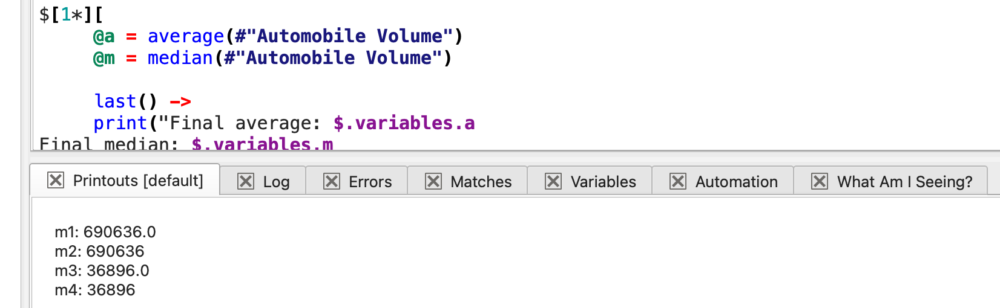
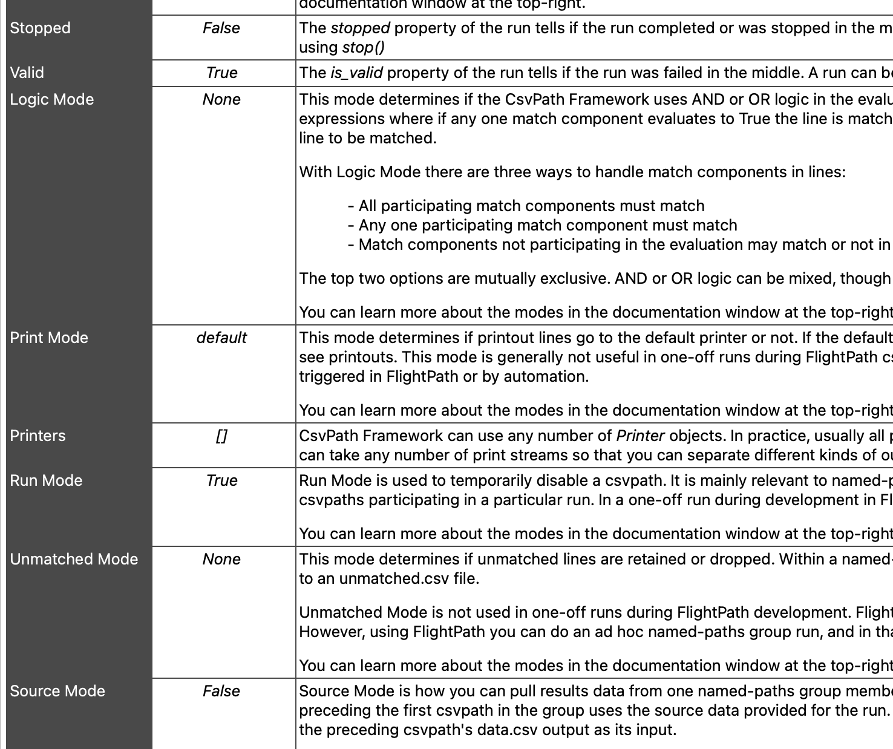
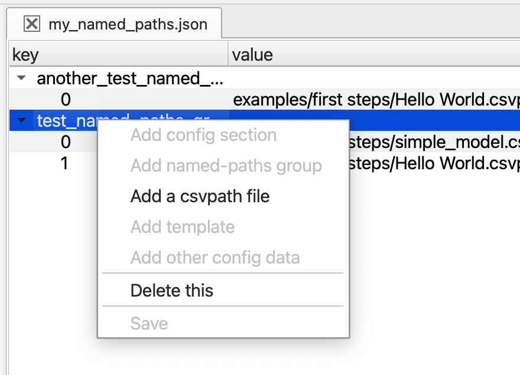
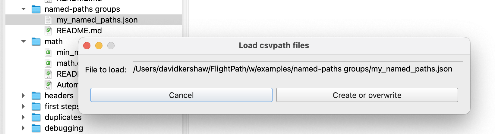
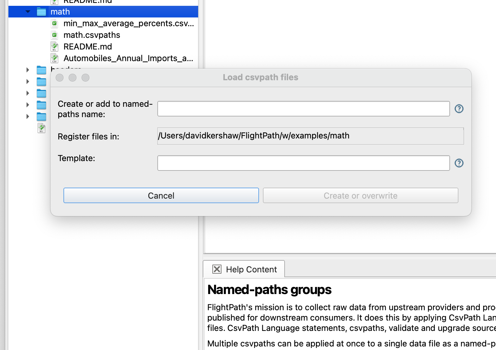
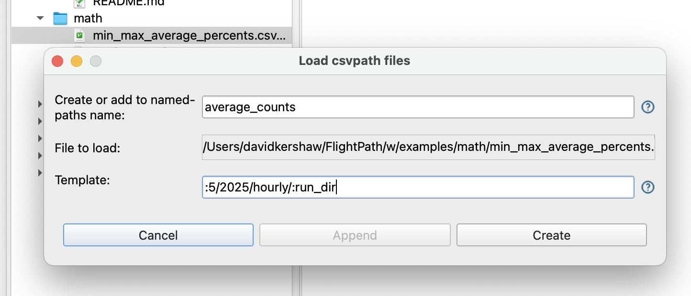
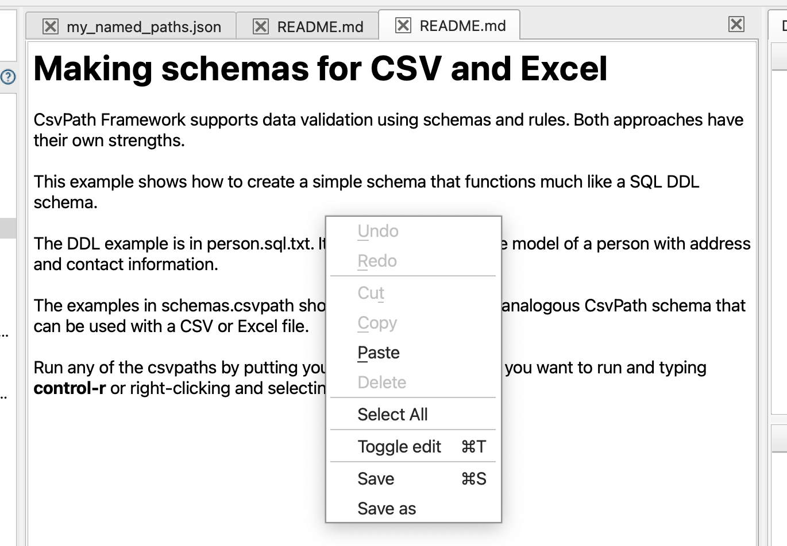
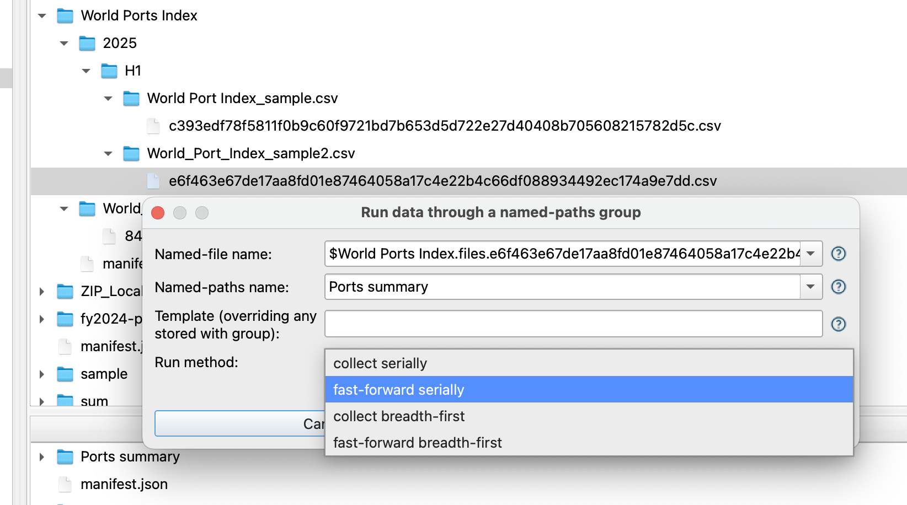

# ✨ Features

## Project Management

FlightPath helps you manage projects so you can partition data flows for easier development and management. Keeping projects focused on one or a small number of data partnerships makes development more agile and allows you to better use compute resources for higher performance and greater scalability.

When you first open FlightPath the app creates a .`flightpath` JSON configuration file in your home directory that points to your `FlightPath` projects folder. You can change the project folder's location in FlightPath's config panel. Next FlightPath creates a `Default` project. In the `Default` project, and every new project, you will see an `examples` directory. You can delete the examples if you don't need them.&#x20;

Creating a new project is as simple as selecting `Create New Project` in the drop-down at the top of the right-hand files tree. Each time you create a project in FlightPath, FlightPath creates a new CsvPath Framework project, with a new config file, archive, logs, and other assets. Every project is completely separate, with its own choice of storage backends and integrations.&#x20;

<figure><figcaption></figcaption></figure>

## Stage Data

CsvPath Framework is all about automating the process of receiving data. But during development you typically need to stage data manually. FlightPath makes it easy. Add your data files using the `Copy data in` button on center of the home screen, or open the project directory and drag your data files in. &#x20;

<figure><figcaption></figcaption></figure>

Then you can simply right-click any file to stage it in your choice of storage backend by selecting `Stage data`.

<figure><figcaption></figcaption></figure>

Give the new named-file a simple, memorable name. Optionally, add a template if you want a particular filesystem path. You can include elements of the original file path in the template.

<figure><figcaption></figcaption></figure>

Now you see your staged data in the `Staged named-files` window at the top of FlightPath's right-hand operations column.

## Write CsvPath Language Validations

Before you can load preboarding steps into CsvPath Framework you have to write them. FlightPath makes CsvPath Language more accessible by giving you a syntax highlighted editor with the ability to look up functions and features, create multi-csvpath files, and do one-off runs to iterate on your scripts.

<figure><figcaption></figcaption></figure>

### In-context Help

Every major feature in FlightPath has in-context help. Wherever you see the question mark icon you can click it to open the `Help and feedback` tray at the bottom of the app. &#x20;

<figure><figcaption></figcaption></figure>

CsvPath Language has over 150 functions to help you craft the right validation rules and data upgrading steps. And CsvPath Framework has many other features to know. FlightPath makes all this power more accessible by providing the Language Helpers tab whenever a csvpath is open. Language Helpers has a tree of help topics and a documentation window that give detailed information on each.

<figure><figcaption></figcaption></figure>

### One-off CsvPath Runs

Each time you iterate on a validation or data upgrading script you will need to run it to check your results. Running a CsvPath Language file is easy. Just right click and select `Run`. Alternatively hit `ctrl-r` .&#x20;

<figure><figcaption></figcaption></figure>

Every one-off run opens the Help and feedback tray with several results tabs:&#x20;

* Printouts
* Logs and errors
* Matching lines
* An example of how to automate the run
* And the `What Am I Seeing?` tab giving details of the run

<figure><figcaption></figcaption></figure>

`What Am I Seeing?` tab explains all the configuration options for the run and how they impacted the results. As well as helping you interpret your results, this is a great place to learn about CsvPath Framework.

<figure><figcaption></figcaption></figure>

### Edit Named-paths Group Definition Files

When your csvpaths are ready for production you need to load them into CsvPath Framework as a set of one or more csvpaths called a named-paths group. You can load a named-paths group from a csvpath file, from all files in a directory, or, for more control, as group defined in a JSON description file.&#x20;

FlightPath can make the JSON option easy. On the one hand, you can push the auto-generated description file back to your FlightPath project for modification by hand, or, alternatively, you can create a description file from scratch with FlightPath's guidance.&#x20;

<figure><figcaption></figcaption></figure>

## Load Named-paths Groups

When you're ready to load your named-paths into CsvPath Framework you just right-click on a file or folder to open the load dialog. There are three options.

First, if you created a JSON definition, you can just select that file.

<figure><figcaption></figcaption></figure>

&#x20;Alternatively, if all your csvpaths are in the same folder you can select to load that folder. When you use a folder you can create one named-paths group with csvpaths from all files included, or you can create one named-paths group for each file in the directory.

<figure><figcaption></figcaption></figure>

Or,  if all your csvpaths are in the same file, or you want to add one or more csvpaths from a file into an existing group, you can just select the file.

<figure><figcaption></figcaption></figure>

With any of these options you can add a template to organize your results tree to follow a file naming convention or separate runs for any reason.

## Edit Markdown Files

DataOps project organization is not enough. For smooth operations, you also need to have documentation. FlightPath lets you add Markdown files for documentation, notes, and instructions.&#x20;

<figure><figcaption></figcaption></figure>

You can edit Markdown files in rendered form, or use the context menu or `ctrl-t` to toggle into raw text for easy formatting.

## Run Named-paths Groups

Running named-files through named-paths groups is how validation, data upgrading, and archiving happen. In production runs are automated, but during development FlightPath lets you kick off runs anytime.&#x20;

<figure><figcaption></figcaption></figure>

FlightPath's Run data and Find data dialogs make it easy to create very specific runs targeting just the data versions or csvpaths you want to exercise.&#x20;

## Find and Explore Results

## Replay Runs

## Configure CsvPath Framework and FlightPath

