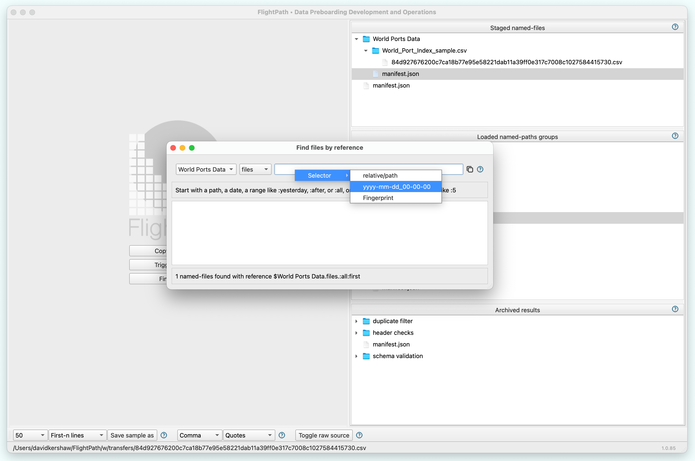
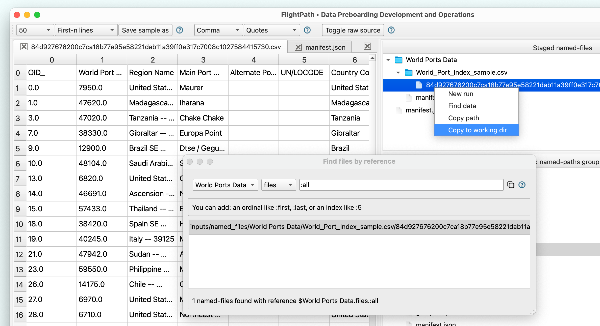
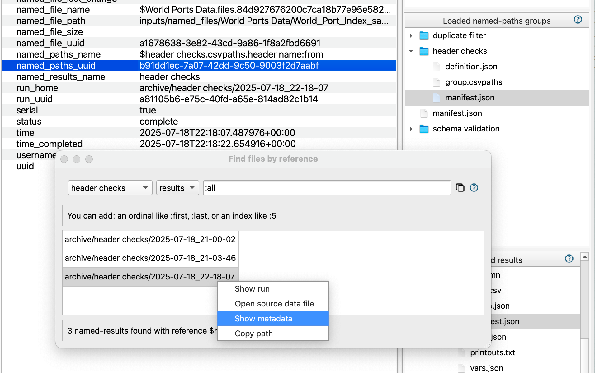
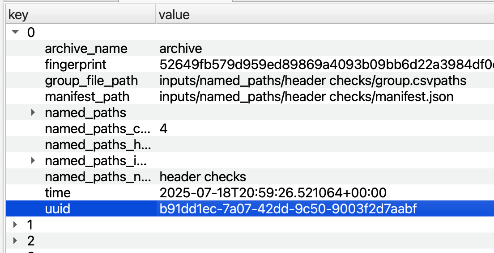
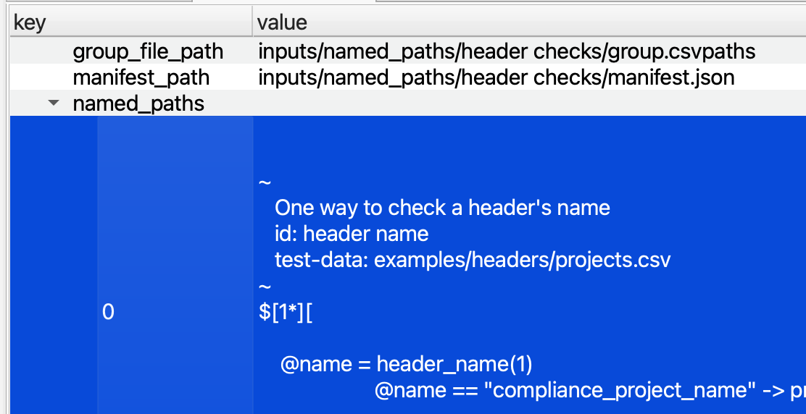
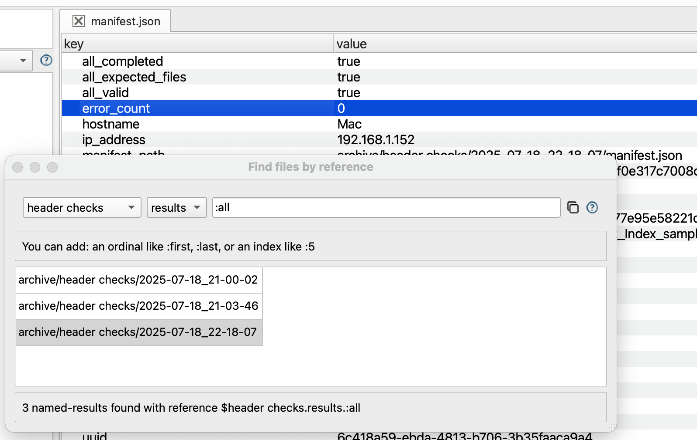
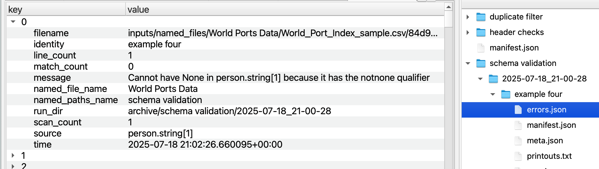
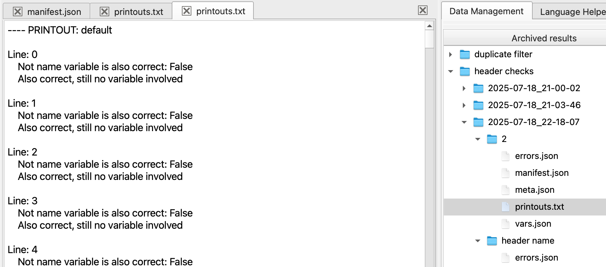

# 🖥️ For BizOps Pros


**FlightPath is a technical tool, similar to an IDE or Azure Storage Explorer.** While a BizOps team member might not use all of FlightPath's functions, in our experience Excel wranglers are totally capable of picking it up and quickly getting value from FlightPath.


## What file was staged most recently&#x20;



* Click the Find data button at the center of the home screen.
* In the drop-downs, select `files` and the named-file you are looking for
* In the text box enter the path, arrival date, range, or fingerprint of the file you are looking for

<figure><figcaption></figcaption></figure>

* When you see the file in the list of results, right-click to open the metadata or the file
* If you want to use the file as test data, right-click on the file in the named-files window and select `Copy to working dir`. This copies the immutably staged file back to the project directory so you can work with the data.

<figure><figcaption></figcaption></figure>



* Access to your archive. If you are working in S3 you will need an IAM user with read access. Your credentials will be in environment variables. You can set environment variable within FlightPath using the `env` tab in the config settings.
* The named-file name. Physical files are staged within named-files. A named file can be setup with any directory structure required, so you have to be familar with the data delivery naming conventions, if they are replicated in your named-file layout.



## What script was used in the last run



* Use the `Find data` button to open the `Find files by reference` dialog. Select `results` and the name of your results.&#x20;
* In the text box replace `:all` with `:last`  or just right click on the last item

<figure><figcaption></figcaption></figure>

* With the run time and named\_paths\_uuid open the named-paths. (The name will always be the same as its results).&#x20;
* Open the named-paths manifest.json and find the entry for the time period with the same UUID.

<figure><figcaption></figcaption></figure>

* Look at the named\_paths key to see the exact CsvPath Language statements used in the run.

<figure><figcaption></figcaption></figure>



You need access to the archive and named-paths areas in whichever backend(s) they are configure for. You may need to add a username and password to your configuration for SFTP or environmental variables for the cloud providers.



## What where the errors in the most recent run



* Use the `Find data` button to open the `Find files by reference` dialog
* Select `results` and your named results.
* Add `:last` to the textbox. Add a partial path or date, if needed.
* Right-click the last item shown in the results list. Select `Show run`.
* Click to open the run manifest.json

<figure><figcaption></figcaption></figure>

* Look at the `error_count` key to see the total errors in the run.
* Click on the directory containing the results of an of the csvpaths in the run. Inside you will see the `errors.json` file containing all errors from the run. Within `errors.json` each item in the list of errors, if any, has a `message` key with the built-in or user-defined error message.

<figure><figcaption></figcaption></figure>

* Depending on how the csvpath was written, there may be useful error-related info in the printouts, if any. If a `printouts.txt` file was generated, click on it to check.

<figure><figcaption></figcaption></figure>







