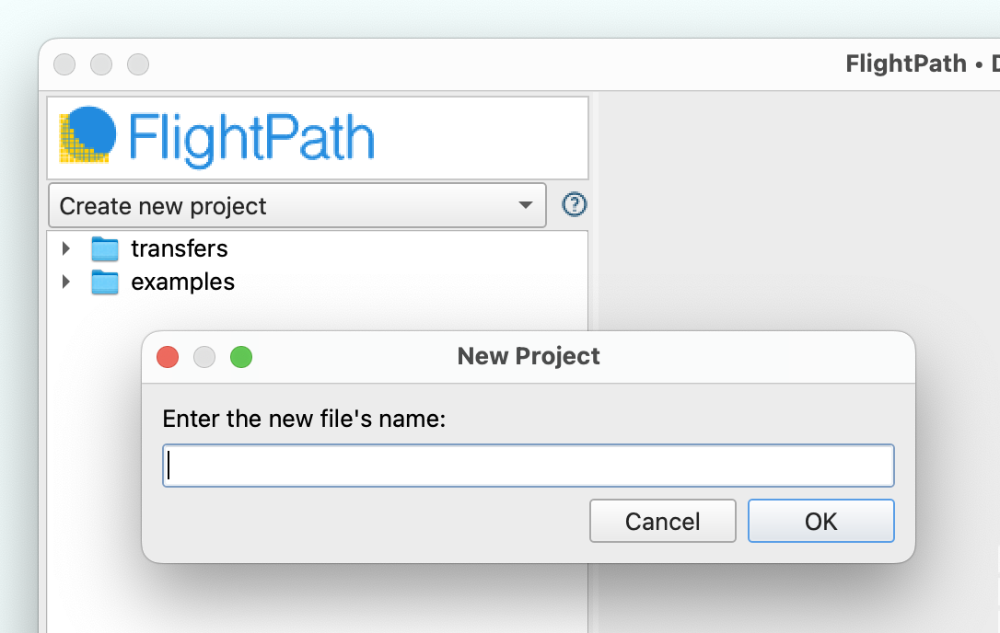

# 🎨 For DataOps Pros


**Learn about CsvPath Framework:** Find lots more information and how-tos about CsvPath Framework automating data preboarding at [https://www.csvpath.org](https://www.csvpath.org/).


## Creating a new project



* Open FlightPath
* Click the Projects drop-down at the top left
* Select `Create new project`&#x20;

<figure><figcaption></figcaption></figure>

* Give the project a name and click `Ok`
* See that your project name is now selected and that two folders appear, `examples` and `transfers` . Examples are build-in how-tos that can be deleted. Transfers is just a folder that can be used for CsvPath Framework's  `transfer-mode`, or for copying files into the project, or deleted.



* A FlightPath install
* Awareness of local machine sandbox constraints on MacOS or any permissions constraints on Windows


